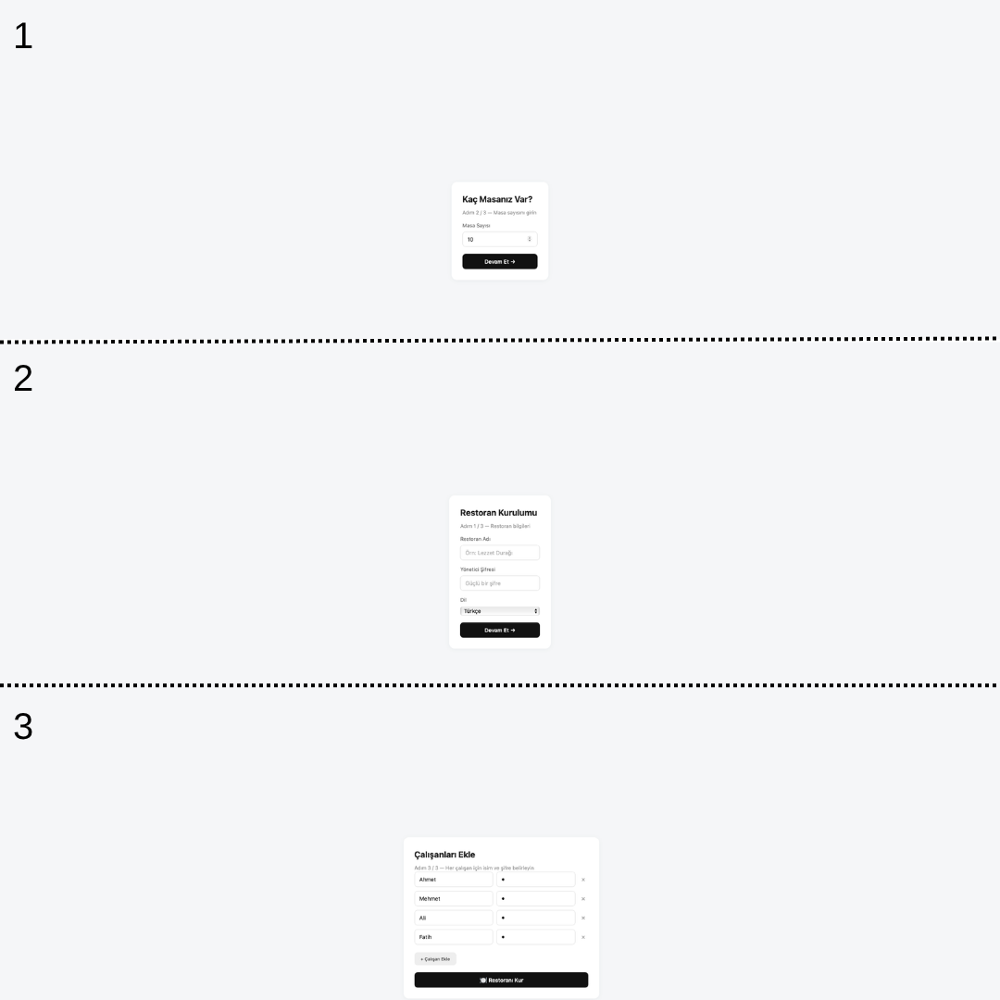
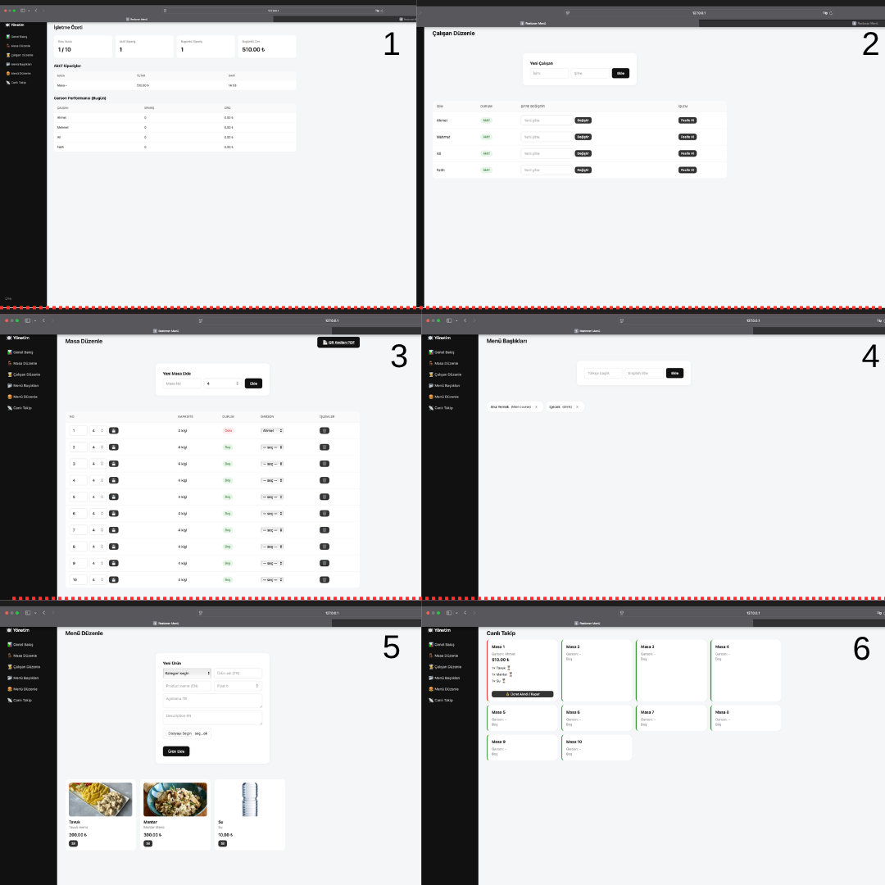
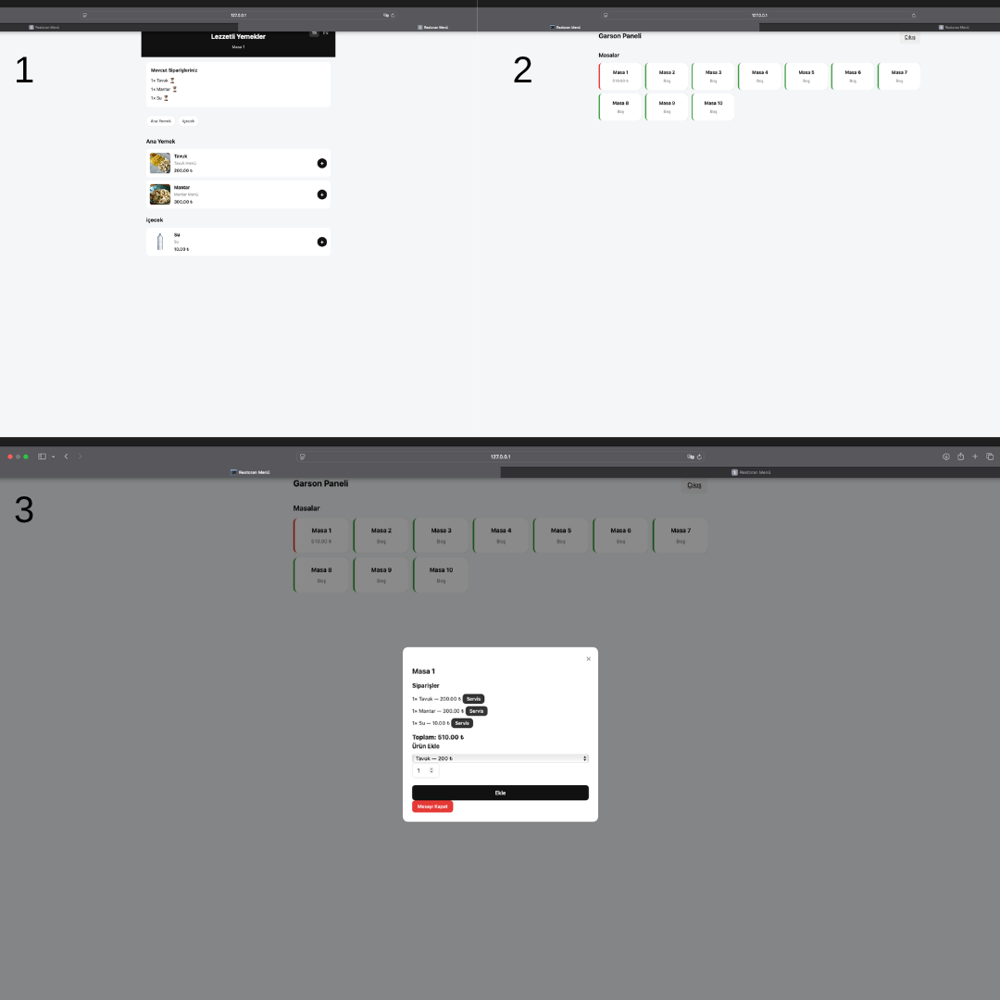

<div align="center">

# 🍽️ TableFlow

### Modern, açık kaynaklı çoklu dil destekli QR menü ve restoran sipariş yönetim sistemi

**Restoran, kafe, bistro, pub ve her türlü yeme-içme mekanı için**  
**tek kurulumda QR menü, garson paneli, canlı takip ve sipariş yönetimi.**

[](https://www.gnu.org/licenses/agpl-3.0)
[](https://www.python.org/)
[](https://flask.palletsprojects.com/)
[](https://www.sqlite.org/)
[](http://makeapullrequest.com)
[](https://github.com/mdaedalus/tableflow)

[Özellikler](#-özellikler) · [Ekran Görüntüleri](#-ekran-görüntüleri) · [Kurulum](#-kurulum) · [Kullanım](#-kullanım-akışı) · [API](#-api-referansı) · [Katkı](#-katkıda-bulunma) · [Lisans](#-lisans)

</div>

---

## 🎯 Nedir Bu?

**TableFlow**, restoranların kağıt menüye veda etmesini sağlayan, modern ve minimalist bir dijital menü + sipariş yönetim sistemidir. Kurulum sihirbazı sayesinde **5 dakikada** restoranınızı sisteme kaydeder, masalarınızı ve çalışanlarınızı tanımlar, her masaya özel **QR kod** üretir ve anında sipariş almaya başlarsınız.

Müşteri QR kodu okutur → menüyü açar → sipariş verir.  
Garson panelden masayı görür → siparişi ekler → servis yapar.  
İşletme sahibi canlı takip ekranından her şeyi izler → kasayı kapatır.

### 💡 Neden TableFlow?

- 🚀 **Sıfır kurulum karmaşası** — SQLite ile dosya tabanlı, harici sunucu gerektirmez
- 📱 **Mobil uyumlu** — müşteri tarafı telefonda kusursuz çalışır
- 🔳 **Her masaya özel QR kod** — tek tıkla A4 PDF olarak indir, yazdır, masaya koy
- 🌍 **Çoklu dil desteği** — Türkçe + İngilizce menü (genişletilebilir)
- 📡 **Canlı takip** — hangi masa dolu, hangi garson hangi masaya bakıyor
- 👨‍🍳 **Garson paneli** — masaya ürün ekle/çıkar, servis durumunu işaretle
- 💰 **Kasa yönetimi** — masayı kapat, ücret alındı olarak işaretle
- 📊 **Garson performansı** — kim bugün ne kadar sipariş aldı, ciro ne kadar
- 🔓 **Açık kaynak** — AGPL-3.0, kendi sunucunuzda barındırın
- 🇹🇷 **Türkçe öncelikli** — yerel işletmeler için tasarlandı
- 🔌 **API-first** — mobil uygulama geliştirmeye hazır mimari

---

## ✨ Özellikler

### 🏢 İşletme Yönetimi
- ✅ 3 adımlı kurulum sihirbazı (Restoran → Masalar → Çalışanlar)
- ✅ Restoran adı ve yönetici şifresi belirleme
- ✅ Dil seçimi (TR / EN)
- ✅ Masa sayısını toplu tanımlama
- ✅ Çalışanları isim + şifre ile kaydetme

### 🪑 Masa Yönetimi
- ✅ Masa ekle / düzenle / sil
- ✅ Kapasite tanımı
- ✅ Her masaya **özel QR kod** (UUID token bazlı)
- ✅ Tüm masaların QR kodlarını **A4 PDF** olarak indirme (2×3 grid)
- ✅ Masaya garson atama

### 👨‍🍳 Çalışan Yönetimi
- ✅ Çalışan ekle / sil / pasife al
- ✅ Şifre belirleme ve değiştirme
- ✅ Her çalışana ayrı giriş (garson paneli)
- ✅ Garson bazlı sipariş ve ciro istatistikleri

### 📂 Menü Yönetimi
- ✅ Kategori (menü başlığı) ekle/sil — **çift dilli** (TR + EN)
- ✅ Ürün ekle/sil — görsel, fiyat, TR/EN adı + açıklaması
- ✅ Kategori bazlı ürün listeleme
- ✅ Ürün görsel yükleme (5 MB limit)
- ✅ Stokta yok / var durumu

### 📡 Canlı Takip
- ✅ Tüm masaların anlık durumu (dolu / boş)
- ✅ Her masada kim var, ne sipariş etti
- ✅ Sipariş kalemlerinin durumu (⏳ bekliyor / ✅ servis edildi)
- ✅ Masayı kapat / ücret alındı işaretle
- ✅ Garson bilgisi görüntüleme

### 🛒 Garson Paneli
- ✅ Şifreli giriş
- ✅ Masaları grid görünümünde listeleme
- ✅ Boş masayı tek tıkla aç
- ✅ Modaldan hızlı ürün ekleme (kategori dropdown'lu)
- ✅ Sipariş kalemini "servis edildi" işaretle
- ✅ Masayı kapat

### 📱 Müşteri Menüsü
- ✅ QR kod okut → doğrudan masanın menüsü
- ✅ Menüyü sadece görüntüleme (sipariş vermeden)
- ✅ Sepete ekle → sipariş gönder
- ✅ Mevcut siparişin durumunu görüntüleme
- ✅ TR / EN dil değiştirme
- ✅ Kategori nav ile hızlı erişim

### 🎨 Tasarım
- ✅ Modern minimalist arayüz
- ✅ Yumuşak gri + siyah palet
- ✅ Responsive (mobil/tablet/masaüstü)
- ✅ Modal tabanlı hızlı işlemler

---

## 🖼️ Ekran Görüntüleri






---

## 🛠️ Teknoloji Yığını

| Katman | Teknoloji |
|--------|-----------|
| **Backend** | Python 3.10+, Flask 3.0 |
| **Veritabanı** | SQLite (dosya tabanlı), SQLAlchemy ORM |
| **Frontend** | Vanilla JS, HTML5, CSS3 |
| **QR Üretimi** | `qrcode[pil]` + `reportlab` (PDF) |
| **Şifreleme** | Werkzeug (PBKDF2) |
| **Şablon** | Jinja2 |
| **Font** | Inter / sistem fontları |

---

## 🚀 Kurulum

### Gereksinimler
- Python 3.10 veya üzeri
- pip

### Adım Adım

```bash
# 1. Repoyu klonla
git clone https://github.com/mdaedalus/tableflow.git
cd tableflow

# 2. Sanal ortam oluştur
python -m venv venv

# Windows:
venv\Scripts\activate

# macOS/Linux:
source venv/bin/activate

# 3. Bağımlılıkları yükle
pip install -r requirements.txt

# 4. Uygulamayı başlat
python app.py
```

Tarayıcınızda açın: **http://localhost:5000**

İlk açılışta **kurulum sihirbazı** otomatik başlar. 🎉

---

## 🗺️ Kullanım Akışı

Sistem üç farklı kullanıcı rolüne sahiptir:

### 1️⃣ Yönetici (İşletme Sahibi)

| Adres | Yaptığı İş |
|-------|------------|
| `http://localhost:5000/` | İlk kurulum sihirbazı |
| `http://localhost:5000/admin/login` | Yönetici girişi |
| `http://localhost:5000/admin/` | Genel bakış (ciro, sipariş, personel) |
| `http://localhost:5000/admin/tables` | Masa düzenle + QR PDF indir |
| `http://localhost:5000/admin/staff` | Çalışan ekle/sil/şifre değiştir |
| `http://localhost:5000/admin/categories` | Menü başlıkları (TR/EN) |
| `http://localhost:5000/admin/products` | Ürün ekle/sil (görsel + fiyat) |
| `http://localhost:5000/admin/live` | Canlı takip + kasa kapat |

### 2️⃣ Garson

| Adres | Yaptığı İş |
|-------|------------|
| `http://localhost:5000/waiter/login` | İsim + şifre ile giriş |
| `http://localhost:5000/waiter/` | Masaları gör, ürün ekle, servis yap |

### 3️⃣ Müşteri

Her masaya özel QR kod okutulur → `http://localhost:5000/m/<token>` adresine gider. Menüyü görüntüler, sipariş verebilir.

---

## 📁 Proje Yapısı

```
tableflow/
├── app.py                       # Ana uygulama (Flask factory)
├── config.py                    # Yapılandırma
├── requirements.txt
├── LICENSE                      # AGPL-3.0
├── README.md
├── .gitignore
│
├── docs/                        # 📸 Ekran görüntüleri
│   └── screenshots/
│
├── database/                    # Veritabanı katmanı
│   ├── __init__.py
│   └── db.py                    # SQLAlchemy başlatma
│
├── models/                      # Veri modelleri
│   ├── __init__.py
│   └── models.py                # Restaurant, Table, Staff, Category, Product, Order, OrderItem
│
├── routes/                      # Blueprint'ler
│   ├── __init__.py
│   ├── setup_routes.py          # Kurulum sihirbazı
│   ├── admin_routes.py          # Yönetici paneli
│   ├── waiter_routes.py         # Garson paneli
│   └── customer_routes.py       # Müşteri menüsü
│
├── utils/                       # Yardımcı fonksiyonlar
│   ├── __init__.py
│   ├── auth.py                  # Oturum & yetki kontrolü
│   └── qr.py                    # QR kod üretimi + PDF
│
├── templates/                   # Jinja2 şablonları
│   ├── base.html
│   ├── setup/                   # Kurulum sihirbazı adımları
│   ├── admin/                   # Yönetici paneli
│   ├── waiter/                  # Garson paneli
│   └── customer/                # Müşteri menüsü
│
├── static/
│   ├── css/style.css
│   ├── js/main.js
│   ├── uploads/                 # Ürün görselleri
│   └── qrcodes/                 # Oluşturulan QR PDF'leri
│
└── instance/
    └── restaurant.db            # SQLite veritabanı (otomatik oluşur)
```

---

## 🔌 API Referansı

Tüm endpoint'ler JSON döner. Mobil uygulama geliştirmek için hazırdır.

### Yönetici

| Metot | Endpoint | Açıklama |
|-------|----------|----------|
| `POST` | `/admin/login` | Yönetici girişi |
| `POST` | `/admin/tables` | Yeni masa ekle |
| `POST` | `/admin/tables/<id>/update` | Masa güncelle |
| `POST` | `/admin/tables/<id>/delete` | Masa sil |
| `POST` | `/admin/tables/<id>/assign` | Masaya garson ata |
| `GET`  | `/admin/tables/qr-pdf` | Tüm masaların QR PDF'i |
| `POST` | `/admin/staff` | Yeni çalışan ekle |
| `POST` | `/admin/staff/<id>/password` | Şifre değiştir |
| `POST` | `/admin/staff/<id>/delete` | Çalışanı pasife al |
| `POST` | `/admin/categories` | Kategori ekle |
| `POST` | `/admin/categories/<id>/delete` | Kategori sil |
| `POST` | `/admin/products` | Ürün ekle (multipart/form-data) |
| `POST` | `/admin/products/<id>/delete` | Ürün sil |
| `POST` | `/admin/order/<id>/close` | Masayı kapat (ücret alındı) |

### Garson

| Metot | Endpoint | Açıklama |
|-------|----------|----------|
| `POST` | `/waiter/login` | Garson girişi |
| `POST` | `/waiter/table/<id>/open` | Masayı aç (yeni sipariş) |
| `POST` | `/waiter/order/<id>/add` | Siparişe ürün ekle |
| `GET`  | `/waiter/order/<id>/items` | Sipariş kalemlerini listele |
| `POST` | `/waiter/item/<id>/serve` | Ürünü "servis edildi" yap |
| `POST` | `/waiter/table/<id>/close` | Masayı kapat |

### Müşteri

| Metot | Endpoint | Açıklama |
|-------|----------|----------|
| `GET`  | `/m/<token>` | Masa menüsü |
| `POST` | `/m/<token>/order` | Müşteri siparişi gönder |

### Örnek İstek

```bash
curl -X POST http://localhost:5000/waiter/order/1/add \
  -H "Content-Type: application/json" \
  -d '{
    "product_id": 3,
    "quantity": 2
  }'
```

---

## 🗺️ Yol Haritası

- [x] v0.1 — Kurulum sihirbazı, masa/çalışan yönetimi, QR PDF
- [x] v0.2 — Menü (kategori + ürün), çoklu dil, garson paneli, canlı takip
- [ ] v0.3 — Adisyon yazdırma (termal yazıcı desteği)
- [ ] v0.4 — Detaylı rapor ve istatistik sayfası (grafikli)
- [ ] v0.5 — Kullanıcı kimlik doğrulama (JWT) + API token
- [ ] v0.6 — Multi-tenant (çoklu restoran desteği)
- [ ] v0.7 — Ödeme entegrasyonu (Stripe, iyzico, Papara)
- [ ] v0.8 — Mutfak ekranı (KDS — Kitchen Display System)
- [ ] v0.9 — 3+ dil desteği (Almanca, Arapça, Rusça)
- [ ] v1.0 — Docker + PostgreSQL + SaaS sürümü

---

## 🤝 Katkıda Bulunma

Katkılarınızı bekliyoruz! Büyük değişiklikler için önce bir **issue** açın.

```bash
# Fork → Clone → Branch → Commit → Push → PR
git checkout -b feature/yeni-ozellik
git commit -m "feat: yeni özellik eklendi"
git push origin feature/yeni-ozellik
```

### Commit Kuralları
- `feat:` yeni özellik
- `fix:` hata düzeltme
- `docs:` dokümantasyon
- `style:` kod formatı
- `refactor:` yeniden düzenleme
- `test:` test ekleme

---

## 💼 Ticari Kullanım & Lisanslama

Bu proje **AGPL-3.0** ile lisanslanmıştır.

### ✅ Yapabilirsiniz
- Ücretsiz kullanmak, değiştirmek, dağıtmak
- Ticari amaçla kullanmak (**açık kaynak şartıyla**)
- Kendi sunucunuzda barındırmak
- Restoranınızda kullanmak

### ⚠️ Şartlar
- Değiştirdiğiniz kodu **açık kaynak** olarak paylaşmalısınız
- Ağ üzerinden (SaaS) sunsanız bile kaynak kodu vermelisiniz

### 💰 Ticari Lisans (Kapalı Kaynak İsteyenler İçin)

Kodunuzu kapatmak veya SaaS olarak satmak istiyorsanız ticari lisans için iletişime geçin:

📧 **eminnesatg@gmail.com**

---

## 👨‍💻 Yazar

**Emin Neşat Gürses**

- 💼 LinkedIn: [Emin Neşat Gürses](https://www.linkedin.com/in/emin-ne%C5%9Fat-g%C3%BCrses-35723a284/)
- 📧 E-posta: [eminnesatg@gmail.com](mailto:eminnesatg@gmail.com)
- 🐙 GitHub: [@mdaedalus](https://github.com/mdaedalus)

---

## 📄 Lisans

Bu proje **GNU Affero General Public License v3.0** ile lisanslanmıştır.  
Detaylar için [LICENSE](LICENSE) dosyasına bakın.

---

<div align="center">

**⭐ Projeyi beğendiyseniz yıldız vermeyi unutmayın!**

[🐛 Bug Bildir](https://github.com/mdaedalus/tableflow/issues) · [💡 Özellik Öner](https://github.com/mdaedalus/tableflow/issues) · [📖 Wiki](https://github.com/mdaedalus/tableflow/wiki)

</div>
